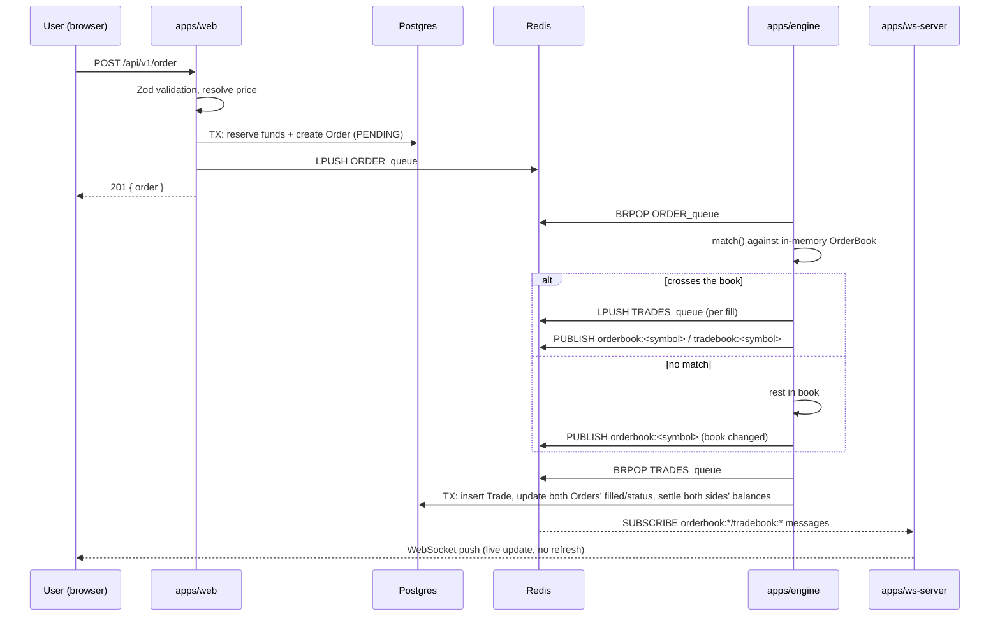

# Architecture

Deeper reference for studying this codebase before an interview. The root [README](../README.md)
covers the same ground at a higher level; this document goes into data flow, invariants, and
failure modes.

## Services and responsibilities

| Service | Responsibility | Talks to |
|---|---|---|
| `apps/web` | Auth, input validation, wallet reservation, order/balance/orderbook REST API, frontend | Postgres (direct), Redis (queues + snapshot reads) |
| `apps/engine` | Matching, trade settlement, order cancellation | Redis (queue consumer + pub/sub publisher), Postgres (direct, via `@repo/db`) |
| `apps/ws-server` | Redis pub/sub → WebSocket fan-out | Redis (subscriber) only |

The web app and the engine never call each other directly — every interaction crosses through
Redis. This means either side can be redeployed independently without the other noticing, at the
cost of everything being eventually consistent across a queue hop rather than a single request/response.

## End-to-end data flow



## Matching-engine internals

`apps/engine/src/orderbook/orderbook.ts` holds, per symbol:

```
bidLevels: Map<price, Order[]>   bidPrices: number[]  (sorted descending)
askLevels: Map<price, Order[]>   askPrices: number[]  (sorted ascending)
```

`getBestPrice(side)` is always `prices[0]`. Within a price level, orders are appended to the array
in arrival order and consumed from the front (`getOrdersAtPrice(...)[0]`), giving FIFO time
priority without any separate timestamp comparison.

`match()` (`apps/engine/src/matcher/matching.ts`) is a `while (order.quantity > 0)` loop:

1. Look up the best price on the *opposite* side (`getTargetSide` flips BUY→SELL, SELL→BUY).
2. If there's no opposite liquidity, or the best opposite price isn't good enough for the incoming
   order's limit, add the (remaining) order to the book and stop.
3. Otherwise, execute against the resting order at that price (`execute.ts`): trade quantity is
   `min(makerQty, takerQty)`, the maker's remaining quantity is reduced (removing it from the book
   entirely if it hits zero), and the taker's remaining quantity is reduced by the same amount.
   Loop back to step 1 — a large taker order can walk multiple price levels in one call.

MARKET orders are priced once by the caller (see below), not recomputed by the engine, except as a
fallback if a MARKET order somehow reaches the queue with no price already attached.

### MARKET order pricing — why it lives in the API layer

A MARKET order has no price of its own, but the wallet still needs to reserve *something* before
the order can be queued, and the engine still needs a bound to prevent an unbounded fill in a thin
book. Both problems are solved by computing one number, once, before the order is queued:

```
ceiling = bestOpposingPrice × (1 ± slippagePercent)
```

`apps/web/app/api/v1/order/route.ts` computes this from the current orderbook snapshot (read from
Redis) and passes it to both `placeOrder()` (as the reservation amount) and the queued message (as
`pricePerUnit`). The engine then treats it exactly like a LIMIT order's price. This guarantees the
amount reserved and the amount the order can actually execute at are always the same number — there
is no second, independent computation inside the engine that could disagree with the first.

If there's no opposing liquidity at submission time, the order is rejected with a 422 before
anything is reserved or queued, rather than resting in the book with an arbitrary or undefined
price (which is what the original implementation did).

## Wallet model and settlement invariants

```prisma
model Balance {
  userId    String
  asset     String   // e.g. "BTC", "USDT"
  available Decimal  // spendable
  reserved  Decimal  // locked against open orders
  @@unique([userId, asset])
}
```

**Placing an order** (`packages/db/src/lib/order.ts#placeOrder`), in one transaction:

```
reserveFunds(tx, userId, requiredAsset, requiredAmount)   -- available -= x, reserved += x
tx.order.create({ ...status: PENDING })
```

`reserveFunds` is a single conditional `UPDATE`:

```sql
UPDATE "Balance"
SET available = available - $amount, reserved = reserved + $amount
WHERE "userId" = $userId AND asset = $asset AND available >= $amount
```

If this affects zero rows (either the balance row doesn't exist, or `available` is too low), it
throws `InsufficientBalanceError` and the whole transaction rolls back — no partial reservation.
The atomicity here comes from Postgres's row lock on the matched row for the duration of the
`UPDATE`, not from application-level locking: two concurrent requests against the same row
serialize on that lock, and the `available >= $amount` predicate is evaluated as part of the same
atomic statement, so it's not possible for both to succeed and overdraw the balance.

**Settling a trade** (`packages/db/src/lib/settlement.ts#settleTrade`), in one transaction:

```
create Trade row
look up both orders (need their `price` — the price each side actually reserved at)
buyer: debit reserved(quote, tradedQty × buyerOrder.price)
       refund available(quote, buyerOrder.price×qty − trade.price×qty)   -- if the buyer's
                                                                          -- limit was more
                                                                          -- generous than the
                                                                          -- execution price
       credit available(base, tradedQty)
seller: debit reserved(base, tradedQty)
        credit available(quote, trade.price × tradedQty)
update both orders' filled/status
```

The refund step exists because a resting maker's price is the execution price — a taker who was
willing to pay more (or accept less) than that gets the difference back. For the maker side of the
same trade, `makerOrder.price == trade.price` always, so the same formula naturally produces a
zero refund there; there's no separate maker/taker branch in the code.

**Cancelling an order** (`packages/db/src/lib/order.ts#finalizeCancelledOrder`), in one transaction:

```
UPDATE "Order" SET status = 'CANCELLED' WHERE id = $id AND status = 'PENDING'
-- if that affected 0 rows, stop: already terminal, nothing to release
release remaining = quantity - filled back to available
```

This function is only ever called by the engine (`apps/engine/src/matcher/cancel.ts`), after the
engine has confirmed the order is still resting in the book and removed it — never by the API route
directly. See the race-avoidance note below.

## Why cancellation is engine-authoritative

A naive cancel implementation — API route marks the order CANCELLED and releases funds directly —
has a race: the order might already be mid-match in the engine (or about to be), so "cancelled in
the DB" and "still resting in the book" can disagree. If a fill then happens against an order the
DB already considers cancelled, you get a phantom trade and a double release of funds.

This codebase closes that window by making the engine the single source of truth for "is this order
still cancellable":

1. `DELETE /api/v1/order/:id` only checks ownership and current status (read-only), then pushes a
   cancel request onto `CANCEL_queue`.
2. The engine's cancel consumer (`apps/engine/src/matcher/cancel.ts`) tries to remove the order from
   its in-memory book by id. If found, it removes it and calls `finalizeCancelledOrder` itself. If
   not found (it was already fully matched before the cancel arrived), it does nothing — the trade
   settlement path already finalized that order as `FILLED`.

The remaining window is just queue latency between "user clicks cancel" and "engine processes it" —
which is surfaced honestly as a 202 ("cancellation requested"), not a 200 ("cancelled").

## Redis usage

| Purpose | Primitive | Keys |
|---|---|---|
| New order intake | List (`LPUSH`/`BRPOP`) | `ORDER_queue` |
| Cancel requests | List | `CANCEL_queue` |
| Trades pending DB settlement | List | `TRADES_queue` |
| Live orderbook/trade fan-out | Pub/Sub | `orderbook:<symbol>`, `tradebook:<symbol>` |
| Late-join snapshot cache | String (`SET`/`GET`, no TTL) | same channel names as above |

Lists are used where exactly-once-per-consumer delivery matters (an order should be matched once, a
trade should be settled once). Pub/Sub is used where fan-out-to-everyone is the point.

## Failure handling

- **Redis unreachable**: every `redis-utils` function no-ops safely if `REDIS_URL` is unset
  (build-time safety), and catches + logs connection errors at runtime rather than crashing. This
  means a Redis outage currently degrades to "orders silently don't reach the engine" rather than a
  loud failure — acceptable for a demo, not for production (see limitations).
- **Malformed queue message**: `consumeFromQueue`'s loop catches per-iteration errors and continues
  polling; a bad message is logged and dropped rather than killing the consumer loop.
- **Malformed order at the engine boundary**: `isValidOrder()` in `matching.ts` re-validates
  side/quantity/price even though the API layer already validated them — the queue is treated as an
  untrusted boundary in its own right.
- **Malformed Redis pub/sub payload at ws-server**: caught and dropped (`safeParseMessage`) instead
  of throwing inside the redis client's event dispatch, which is not wrapped in try/catch and would
  otherwise crash the process.
- **Trade settlement failure**: if `settleTrade`'s transaction throws (e.g. a referenced order is
  somehow missing), the error is logged and the trade is lost from the durability path — it already
  happened in the in-memory book and was broadcast to clients, but never landed in Postgres. There's
  no dead-letter queue or retry here; see limitations.

## Security boundaries

- Every mutating endpoint (`POST /api/v1/order`, `DELETE /api/v1/order/:id`) re-derives the acting
  user from the verified session cookie — the request body's fields are never trusted for identity.
- `GET /api/v1/order`, `GET /api/v1/balances` scope their query to the authenticated user's own
  `userId`; there is no way to fetch another user's orders or balances.
- Passwords are bcrypt-hashed; sessions are signed (not encrypted) JWTs — the payload
  (`userId`, `email`) is not sensitive, so this is an appropriate tradeoff over JWE.

## Known limitations (see also the README)

- Single-engine-instance assumption — no shared/replicated orderbook state across replicas.
- Resting orders are not durably snapshotted; an engine restart loses open orders from the book
  (though the DB `Order` row and reserved funds are unaffected).
- No dead-letter queue for failed trade settlement.
- The price-level index is a sorted array, not a heap/tree — fine at this scale, not at real
  exchange scale.
- The in-memory matching path does plain floating-point arithmetic on order quantities (verified
  live: a `0.1` BTC resting order reduced by `0.04` shows as `0.06000000000000005` in an orderbook
  snapshot). Postgres balances/orders are exact `Decimal(65,30)` and unaffected — this only shows up
  in the in-memory book's own bookkeeping/display, not in settled balances.
